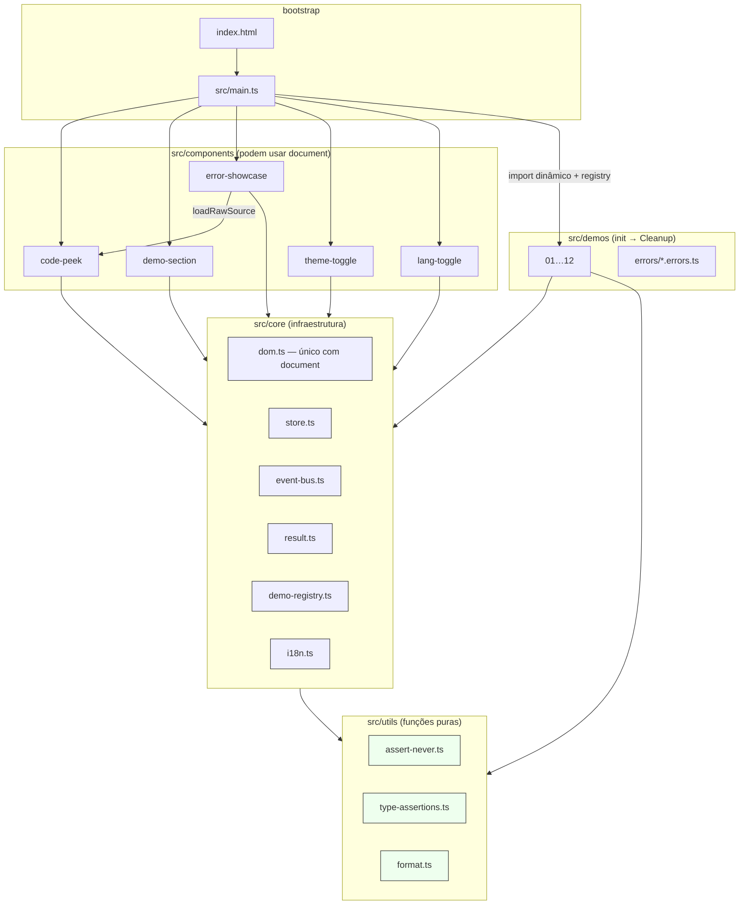
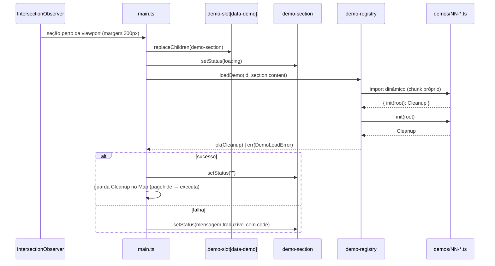

# Arquitetura

Arquitetura do **perfect-typescript-example** — camadas, regra de dependências, ciclo de
vida das demos, estratégia de testes e política de dependências. Tudo aqui descreve o que
existe no código; os caminhos são clicáveis no repositório.

---

## Visão geral

Uma **landing page estática** (HTML + CSS + TypeScript compilado) com:

- **12 demos** carregadas sob demanda (chunk próprio, `IntersectionObserver`);
- **5 custom elements** que enriquecem o HTML declarativo do `index.html`;
- **infraestrutura tipada** (`core`/`utils`) que não conhece nem as demos nem os componentes;
- **i18n** en-US ⇄ pt-BR com dicionário completo em tempo de compilação.

Zero dependências de runtime: o que está em `package.json → devDependencies` nunca chega
ao navegador.

---

## Camadas e regra de dependências

### Regra (implementada e ENFORÇADA)

| Camada           | Pode importar                      | Não pode importar             |
| ---------------- | ---------------------------------- | ----------------------------- |
| `src/utils`      | (nada do projeto — funções puras)  | `core`, `demos`, `components` |
| `src/core`       | `utils` e outros módulos de `core` | `demos`, `components`         |
| `src/components` | `core`, `utils`                    | —                             |
| `src/demos`      | `core`, `utils`                    | —                             |
| `src/main.ts`    | tudo (orquestrador)                | —                             |

A violação **quebra o lint**: `eslint.config.js` aplica `no-restricted-imports` com
patterns (`**/demos/**`, `@/components/**`…) nos glob `src/core/**` e `src/utils/**`.
Acesso a `document` só existe em `core/dom.ts`, `components/*` e `init()` das demos —
o restante do código fala com o DOM por esses caminhos.

### Critério `interface` × `type`

- **`interface`**: formatos de objeto "contractuais", possivelmente estendidos
  (`DemoModule`, `Payload`, `FlagRow`, `Ok`/`Err` — a regra
  `consistent-type-definitions` do ESLint padroniza isso e melhora as mensagens de erro).
- **`type`**: uniões (`Result`, `RequestState`, `DemoId`), interseções/brands
  (`Brand<T, L>`), tipos computados (`RouteParams`, `Equal`) e aliases (`Cleanup`).

---

## Ciclo de vida de uma demo

Contratos:

- **`init(root: HTMLElement): Cleanup`** — toda demo monta dentro do `root` recebido
  (o `.content` do `<demo-section>`) e devolve `type Cleanup = () => void`.
- **Cleanup** remove listeners via `AbortController` (todos os `addEventListener` da demo
  recebem `{ signal }`) e cancela timers/assinaturas (ex.: `store.subscribe` no demo 02,
  `activeRequest.abort()` no demo 11).
- **Falha é `Result`**: `loadDemo` devolve `Result<Cleanup, DemoLoadError>` com
  `code ∈ { not-registered, import-failed, init-failed }` — a UI traduz o código; exceção
  só para bug de programação (registro duplicado, `assertNever` violado).

---

## i18n (en-US ⇄ pt-BR)

- **`src/core/i18n.ts`** (puro, sem DOM): dicionário `en` (`as const`, fonte das chaves via
  `keyof typeof en`) e `pt-BR` (`satisfies Record<TranslationKey, string>` — **faltar uma
  chave é erro de compilação**), estado do idioma e um `EventBus` tipado
  (`languagechange`).
- **`src/components/lang-toggle.ts`** (única varredura do documento): aplica
  `data-i18n` (texto), `data-i18n-aria` (rótulos) e `data-i18n-content` (meta
  description), atualiza `<html lang>` e o `<title>`, persiste em `localStorage` e
  emite no barramento — os componentes re-renderizam seus textos internos.
- Decisão: o **conteúdo das demos** (rótulos técnicos curtos) permanece em inglês; a
  casca da página (títulos, resumos, controles) é totalmente traduzida.

---

## Estratégia de testes

| Nível              | Onde                 | Comando              | O que cobre                                                                                                                      |
| ------------------ | -------------------- | -------------------- | -------------------------------------------------------------------------------------------------------------------------------- |
| Runtime            | `tests/unit/*`       | `npm run test`       | Lógica pura em Node: store, event-bus, result, format, pipe/groupBy, validador, rotas, `fetchJson` (fetch mockado + fake timers) |
| Tipo               | `tests/types/*`      | `npm run test:types` | `expectTypeOf` + `Expect<Equal<A, B>>`: equivalências, não-assignability, exaustividade                                          |
| Erros intencionais | `src/demos/errors/*` | `npm run typecheck`  | Cada `@ts-expect-error` precisa de um erro real — “unused directive” quebra a build                                              |
| Ponte das duas     | `npm run check`      | tudo em sequência    | typecheck → lint → test → test:types → build                                                                                     |

Princípios:

1. **Teste só o que é puro** — toda a lógica das demos é função pura separada do DOM;
   o DOM é fininho o suficiente para ser validado por smoke test headless (12/12 montam).
2. **Sem dependência de rede**: `fetchJson` é testado com `vi.stubGlobal('fetch', …)` e
   timeout com `vi.useFakeTimers()` — determinístico.
3. **A ferramenta mais estrita possível**: onde o runtime não prova (assignability,
   extração de parâmetros em nível de tipo), prova o compilador.

---

## Política de dependências

**Runtime: proibido.** Qualquer pacote em `dependencies` exigiria justificativa escrita
aqui — hoje o conjunto é vazio e o bundle não contém terceiros.

**DevDependencies (7 — todas justificadas):**

| Pacote                         | Papel                                                                  | Por que não dá para dispensar                                             |
| ------------------------------ | ---------------------------------------------------------------------- | ------------------------------------------------------------------------- |
| `typescript` (~6.0.3)          | compilador (também roda os testes de tipo)                             | é o assunto do projeto; travado porque `typescript-eslint` exige `<6.1.0` |
| `vite`                         | dev server, build, alias, `?raw`, `define`, loader do Vitest           | ferramenta de build pura — nenhum byte vai ao navegador                   |
| `vitest`                       | testes de runtime e de tipo (`--typecheck`)                            | mesma base do Vite (sem config extra)                                     |
| `eslint` + `typescript-eslint` | lint **type-aware** (strict + stylistic) e regra de camadas            | detém o que o `tsc` não vê (regras de projeto)                            |
| `prettier`                     | formatação                                                             | sem regras de formatação no ESLint → não precisa de “config-prettier”     |
| `@types/node`                  | tipos das APIs de Node em `vite.config.ts` (`node:module`, `node:url`) | única exceção à lista base; só o arquivo de configuração usa              |

Não usamos `jsdom`/`happy-dom`: os testes são de lógica pura em Node (a alternativa
custaria dependência extra sem cobrir nada novo).

---

## Desvios em relação à estrutura original e convenções

- **`src/core/i18n.ts` + `src/components/lang-toggle.ts`**: adicionados para atender ao
  requisito de página em inglês com botão de tradução (a estrutura original não previa i18n).
- **`src/types/domain.ts`**: tipos JSON compartilhados (`Json`, `JsonObject`).
- **`.gitignore` / `.prettierignore`**: higiene básica do repositório.
- **Cabeçalho padrão** em todo `.ts`: `@file` / `@purpose` / `@techniques` / `@usedBy`.
- **Comentário de primeiro uso**: na primeira aparição de um recurso do catálogo, o
  comentário explica _o que é_ e _por que está ali_.
- **`as` é exceção documentada**: cada ocorrência tem comentário justificando (fábricas de
  brand, ponte pós-validação, cast interno do `pipe`).
